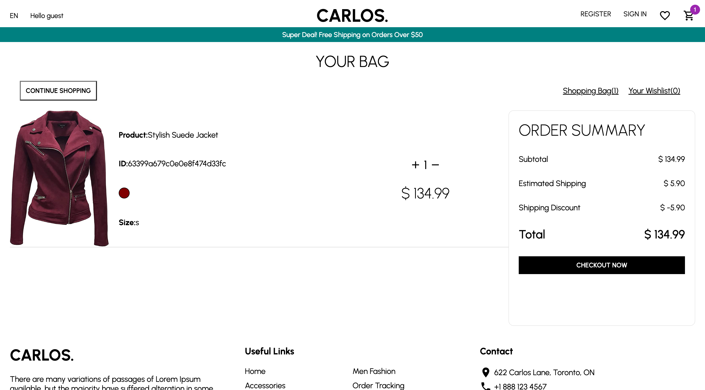
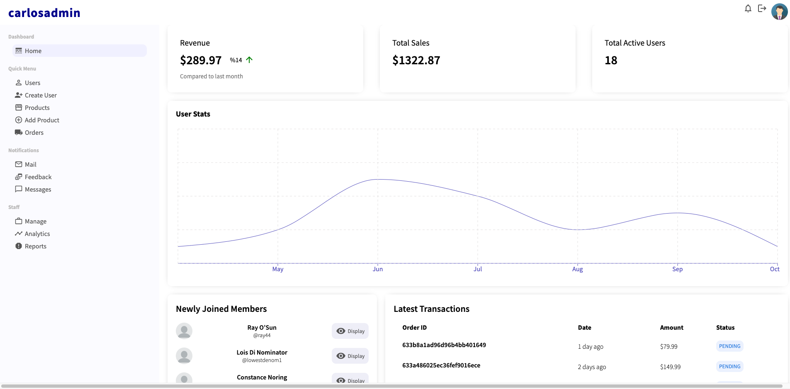

# Carlos Commerce MERN Stack App

## Table of contents

- [Carlos Commerce MERN Stack App](#carlos-commerce-mern-stack-app)
  - [Table of contents](#table-of-contents)
  - [Overview](#overview)
    - [About](#about)
    - [Client Side](#client-side)
    - [Admin Side](#admin-side)
    - [Backend](#backend)
  - [Built with](#built-with)
  - [Author](#author)

## Overview

### About

Carlos e-commerce is a fully functional e-commerce store project. The client and admin side of this project were built with React and Redux. The backend was created using Node JS and stored in a MongoDB database. 

### Client Side

On the client side users should be able to:
- Register a new account (Passwords encrypted using JSCrypto)
- Login / logout using their account credentials
- Add / remove products from Favorites & Shopping Cart 
- Favorites and Shopping Cart items are saved in browser using Redux Persist Gate
- Sort products based on category, price, color or date
- Checkout using Stripe payment method
  - Can be validated using test Visa card -- #: 4242 4242 4242 4242 exp: 08/24 cvv: 123

View the client side here: [Carlos Commerce Client](https://carloscommerce.onrender.com/)

### Admin Side

On the admin side, authenticated users should be able to:
- View orders/users/product stats
- Add/edit/delete products or users
  - I've disabled the delete function on the backend so deleting only will affect the redux slice and not the database
- When creating new products or users images are automatically uploaded to Firebase
- Lists were made using MUI React Data Grids
- Charts were made using Recharts
- For testing admin page, log in credentials are:
  - username: admin / pass: 12345

View the admin side here: [Carlos Commerce Admin](https://carloscommerce-admin.onrender.com/)

### Backend

The backend API was created using Node express and mongoose. 

## Built with

- [React](https://reactjs.org/) - JS library
- [React Router](https://reactrouter.com/en/main)
- [Redux](https://redux.js.org/)
- [Redux Persist](https://www.npmjs.com/package/redux-persist)
- [MUI](https://mui.com/) - MUI Icons & Data Grids
- [Styled Components](https://styled-components.com/) - For styles
- [MongoDB](https://www.mongodb.com/) - For database
- [Node Express](https://expressjs.com/)
- [CryptoJS](https://www.npmjs.com/package/crypto-js?activeTab=readme)
- [Stripe](https://stripe.com/en-ca) - For payment
- [Recharts](https://recharts.org/en-US/)
- [Firebase](https://firebase.google.com/) - For uploading images

## Author

- [Mick Maratta](https://www.mickmaratta.me)
